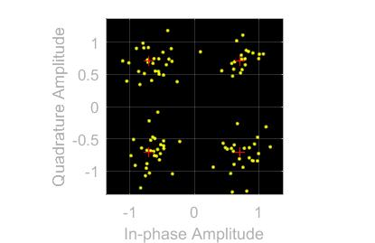
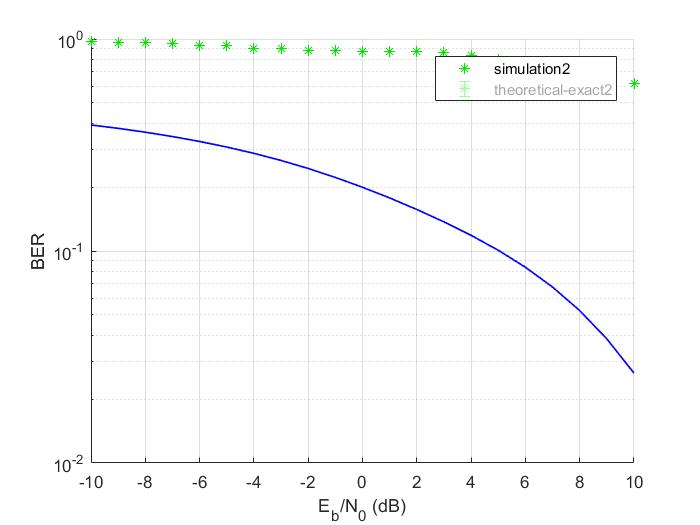

# Digital Communication Project
Simulate the performance of different modulation schemes in an AWGN environment:
- Basic schemas
    - [BPSK](#BPSK)
    - [QPSK](#QPSK)
    - [FSK](#FSK)
    - [QAM16](#QAM16)
    - [QAM64](#QAM64)
- With raised cosine
    - [BPSK](#BPSK)
    - [QPSK](#QPSK)
    - [FSK](#FSK)
    - [QAM16](#QAM16)
    - [QAM64](#QAM64)
# Raised cosine
For raised cosine modules, click here

 # Common instructions:
 1. Open matlab
 2. Open bit error tool by Typing `bertool` in the matlab command window
 3. From theoretical tab:
    1. put the Eb/No = -10:10
    2. Channel type = AWGN
    3. modulation type = [PSK, FSK or QAM based on required modulation technique]
    4. modulation order = (BPSK:2, FSK:2, QPSK:4, QAM16: 16, QAM64:64)
    5. click plot button to get the theoretical curve
 4. In the Monte Carlo tap do the following:
    1. put the Eb/No = -10:10
    2. click browse and choose the file based on required modulation scheme (the file of slx extension)
    3. make variable name = [name of the file]
    4. click run button to get the simulated curve

# BPSK
## Explanation: 
- Binary Phase Shift Keying is a two phase modulation scheme, where the 0’s and 1’s in a binary message are represented by two different phase states in the carrier signal.
- BPSK is the most simple method to encode data in the phase as it uses two phases +180° and -180° to represent 0 or 1.
- It handles the highest noise level or distortion before the demodulator reaches an incorrect decision. That makes it the most robust of all the PSKs. It is, however, only able to modulate at 1 bit/symbol and so is unsuitable for high data-rate applications.

## Plot before noise

## Plot after noise

## BER Curve

#  QPSK
## Explanation: 
- Quadrature phase shift keying is another modulation technique, and it’s a particularly interesting one because it actually transmits two bits per symbol. In other words, a QPSK symbol doesn’t represent `0 or 1` but it represents `00, 01, 10, or 11`.
- This two-bits-per-symbol performance is possible because the carrier variations are not limited to two states. the carrier varies in terms of phase, not frequency, and there are four possible phase shifts.
- We have 360° of phase to work with and four phase states, and thus the separation should be 360°/4 = 90°. So our four QPSK phase shifts are 0°, 90°, 180°, and 270°.
- Compared to modulation schemes that transmit one bit per symbol, QPSK is advantageous in terms of bandwidth efficiency.
## Plot before noise

## Plot after noise

## BER Curve

##  FSK
### Explanation: 
- Frequency Shift Keying (FSK) is the digital modulation technique in which the frequency of the carrier signal varies according to the digital signal changes. FSK is a scheme of frequency modulation.
- The output of a FSK modulated wave is high in frequency for a binary High input and is low in frequency for a binary Low input. The binary 1s and 0s are called Mark and Space frequencies.

## Plot before noise

## Plot after noise

## BER Curve

## QAM16
## Explanation 
- Quadrature amplitude modulation is the name of a family of digital modulation methods and a related family of analog modulation methods widely used in modern telecommunications to transmit information. It conveys two digital bit streams, by modulating the amplitudes of two carrier waves, using the amplitude-shift keying (ASK) digital modulation scheme or amplitude modulation (AM) analog modulation scheme. The two carrier waves of the same frequency are out of phase with each other by 90° (orthogonal). Being the same frequency, the modulated carriers add together, but can be coherently separated (demodulated) because of their orthogonality property. Another key property is that the modulations are low-frequency/low-bandwidth waveforms compared to the carrier frequency, which is known as the narrowband assumption.

- QAM, quadrature amplitude modulation provides some significant benefits for data transmission. As 16QAM transitions to 64QAM, 64QAM to 256 QAM and so forth, higher data rates can be achieved, but at the cost of the noise margin.

- As the QAM order increases, so the distance between the different points on the constellation diagram decreases and there is a higher possibility of data errors being introduced. To utilise the high order QAM formats, the link must have a very good Eb/No otherwise data errors will be present.
Accordingly there is a balance to be made between the data rate and QAM modulation order, power and the acceptable bit error rate.

## Plot before noise

## Plot after noise

## BER Curve

## QAM64
## Explanation
mentioned in [QAM16 explanation](#QAM16_explanation)
## Plot before noise

## Plot after noise

## BER Curve
