# Digital Communication Project
Simulate the performance of different modulation schemes in an AWGN environment with applying **raised cosine pulse shaping**:
- [BPSK](#BPSK)
- [QPSK](#QPSK)
- [FSK](#FSK)
- [QAM16](#QAM16)
- [QAM64](#QAM64)

 # Common instructions:
 1. Open matlab
 2. Open bit error tool by Typing `bertool` in the matlab command window
 3. From theoretical tab:
    1. put the Eb/No = -10:10
    2. Channel type = AWGN
    3. modulation type = [PSK, FSK or QAM based on required modulation technique]
    4. modulation order = (BPSK:2, FSK:2, QPSK:4, QAM16: 16, QAM64:64)
    5. click plot button to get the theoretical curve
 4. In the Monte Carlo tap do the following:
    1. put the Eb/No = -10:10
    2. click browse and choose the file based on required modulation scheme (the file of slx extension)
    3. make variable name = [name of the file]
    4. click run button to get the simulated curve

# BPSK
## Plot before noise
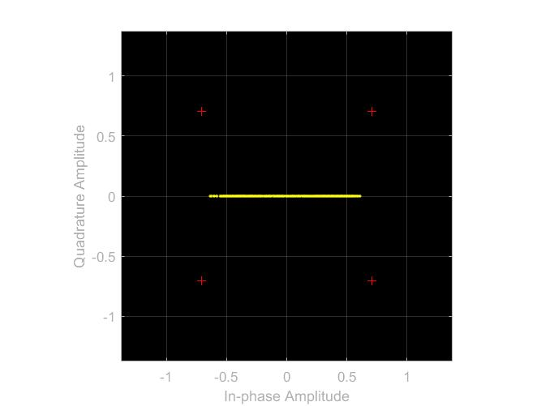
## Plot after noise
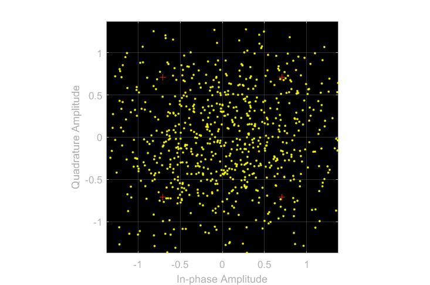
## BER Curve
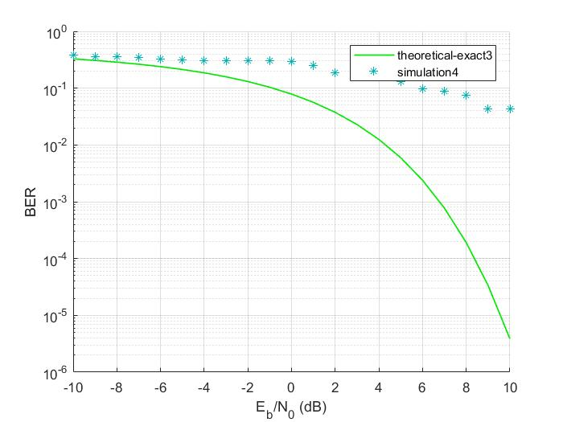

#  QPSK

## Plot before noise
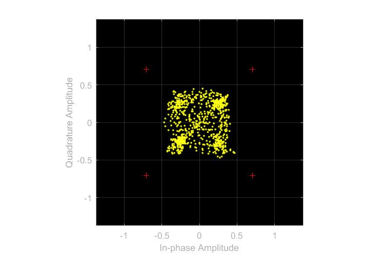
## Plot after noise
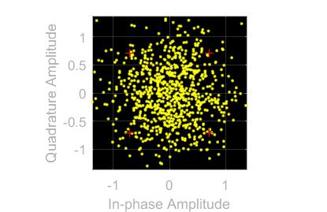
## BER Curve
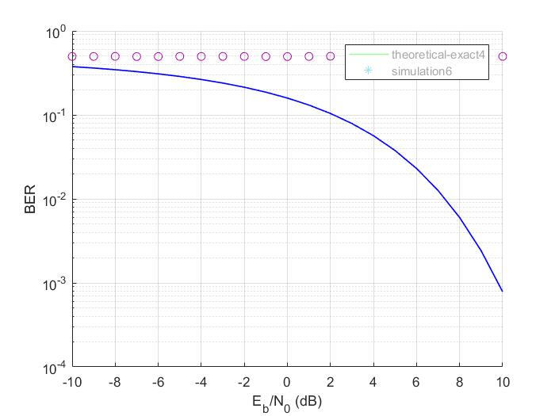

##  FSK

## Plot before noise
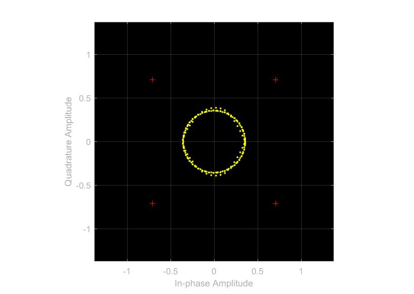
## Plot after noise
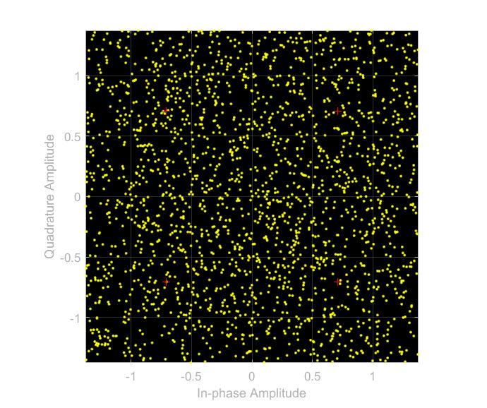
## BER Curve

## QAM16

## Plot before noise
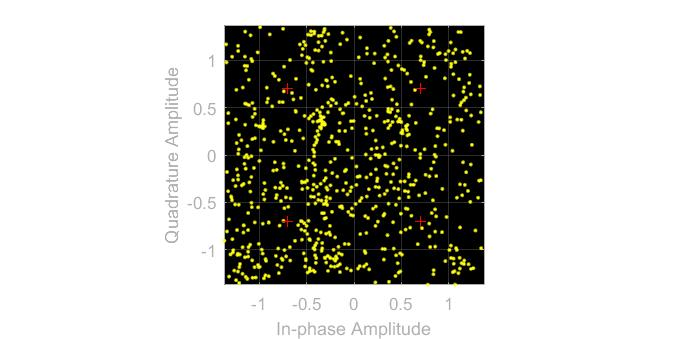
## Plot after noise
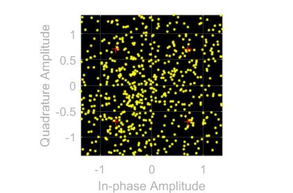
## BER Curve
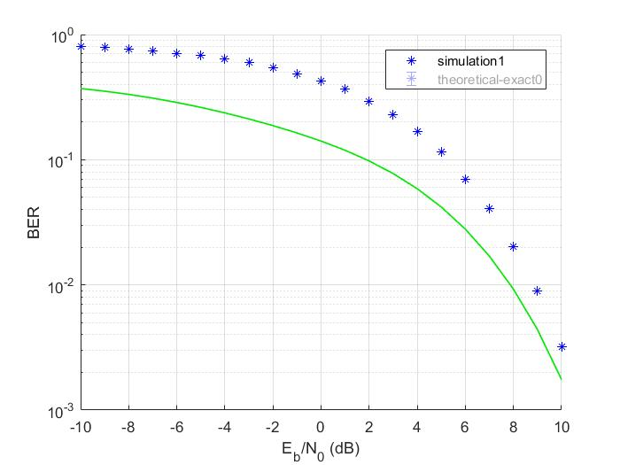

## QAM64
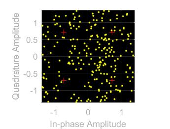
## Plot after noise

## BER Curve
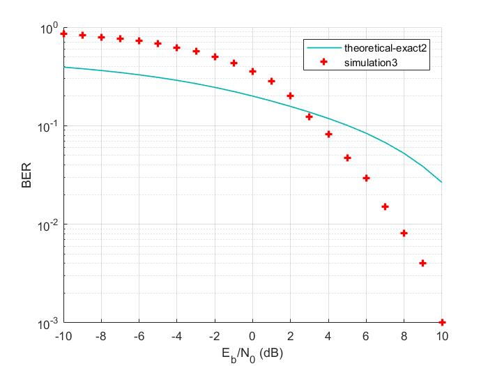